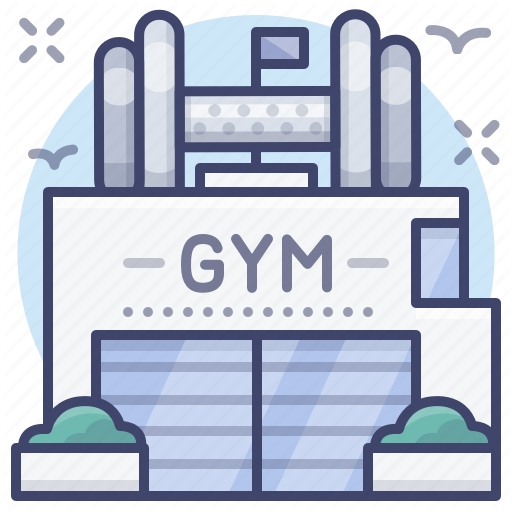

[![MIT License][license-shield]][license-url]

<!-- PROJECT LOGO -->
 

    
  <h3 align="center">My GYM Manager</h3>

  

    A Flutter language based GYM Management App!

<!-- TABLE OF CONTENTS -->

  
Table of Contents

  <ol>
    <li>
      <a href="#about-this-project">About This Project</a>
      <ul>
        <li><a href="#built-with">Built With</a></li>
      </ul>
    </li>
    <li>
      <a href="#getting-started">Getting Started</a>
      <ul>
        <li><a href="#prerequisites">Prerequisites</a></li>
        <li><a href="#installation">Installation</a></li>
      </ul>
    </li>
    <li><a href="#usage">Usage</a></li>
    <li><a href="#contributing">Contributing</a></li>
    <li><a href="#license">License</a></li>
    <li><a href="#contact">Contact</a></li>
    <li><a href="#acknowledgements">Acknowledgements</a></li>
  </ol>

<!-- ABOUT THE PROJECT -->
## About This Project

    

This is a Flutter based Android Application Development project done onbehalf of the Mobile Application Development Module. First of all please bare following things in your mind,    

* This App will demonstrate basic functionalities of what I have learned. (First time Flutter Learner)
* This is not a fully completed app.
* Most of the functions are yet be learned and applied. But you will be able to do some basic functionalities in the app. :smile:

Now let's see what is the purpose of the app! This is more like a day to day tracking app where GYM owner can keep record of members, trainers, equipments and financial records. It is not like a complete complex database driven app. This is more like a entry level app which provide basic CRUD activites for the app functions. 

A list of commonly used resources that I find helpful are listed in the acknowledgements.

### Built With

These are the main languages and services I used for this project.
* [Flutter](https://flutter.dev/)
* [Firebase](https://firebase.google.com/)

<!-- GETTING STARTED -->
## Getting Started

Following instruction will give you an idea about how you can setup this project locally.

### Prerequisites

You need to have following software and languages to start this.
* Latest Android Studio
and
* Visual Studio Code (I prefer to use VS Code along with Android Studio for coding which is much more simple and elegent when coding)
* Flutter SDK

### Installation

1. Install both Android Studio & VS Code or just Android Studio
2. Install Flutter

If you have installed all the things correctly then you can open up one of the editors and start using this project.

<!-- USAGE EXAMPLES -->
## Usage

Following screenshots of the app will give you an idea about how this app works.  

<!-- CONTRIBUTING -->
## Contributing

Contributions are what make the open source community such an amazing place to be **learn, inspire, and create**. Any contributions you make are **greatly appreciated**.

1. Fork the Project
2. Create your Feature Branch or Use Master Branch
3. Commit your Changes
4. Push to the Branch
5. Open a Pull Request

<!-- LICENSE -->
## License

Distributed under the MIT License.

<!-- CONTACT -->
## Contact

My Name - Indrajith

Project Link: [https://github.com/MAD-assignment/Gym-Management-System](https://github.com/MAD-assignment/Gym-Management-System)

<!-- ACKNOWLEDGEMENTS -->
## Acknowledgements
* [GitHub Emoji Cheat Sheet](https://www.webpagefx.com/tools/emoji-cheat-sheet)
* [Img Shields](https://shields.io)
* [Choose an Open Source License](https://choosealicense.com)
* [GitHub Pages](https://pages.github.com)
* [Animate.css](https://daneden.github.io/animate.css)
* [Loaders.css](https://connoratherton.com/loaders)
* [Slick Carousel](https://kenwheeler.github.io/slick)
* [Smooth Scroll](https://github.com/cferdinandi/smooth-scroll)
* [Sticky Kit](http://leafo.net/sticky-kit)
* [JVectorMap](http://jvectormap.com)
* [Font Awesome](https://fontawesome.com)

